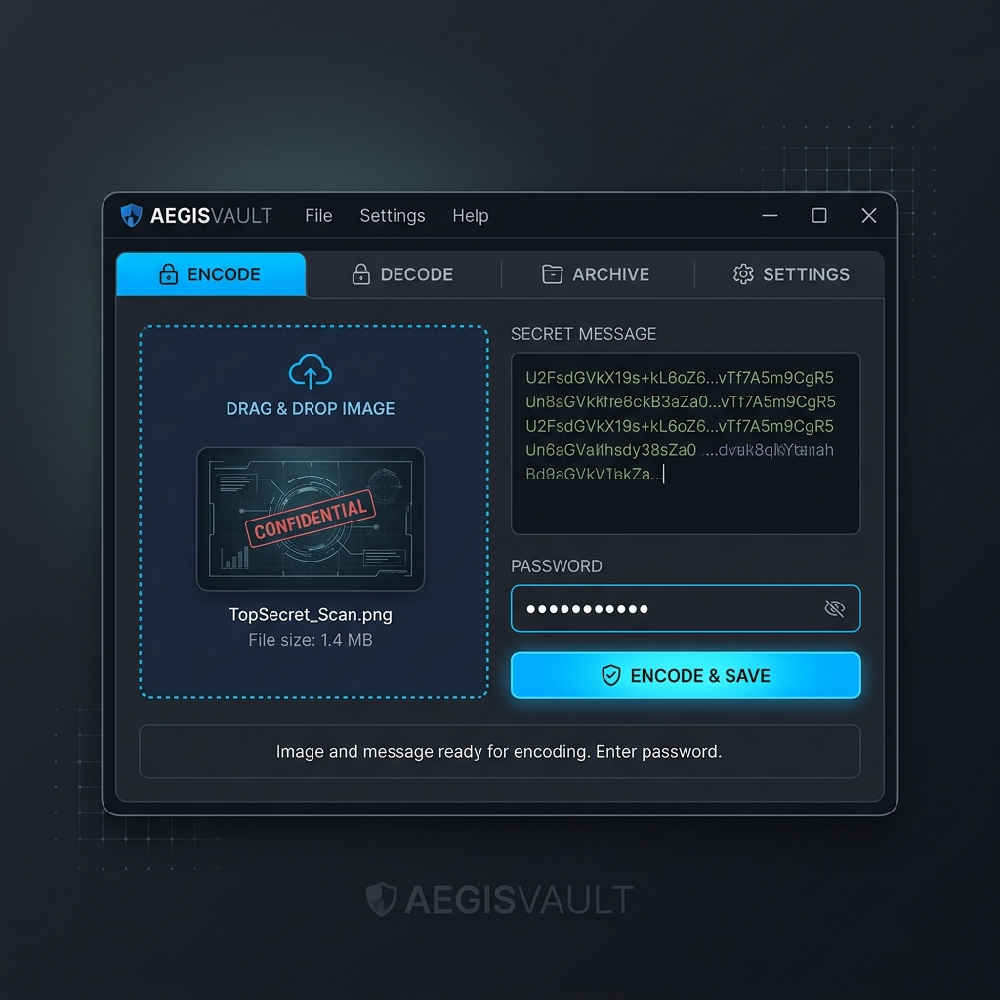
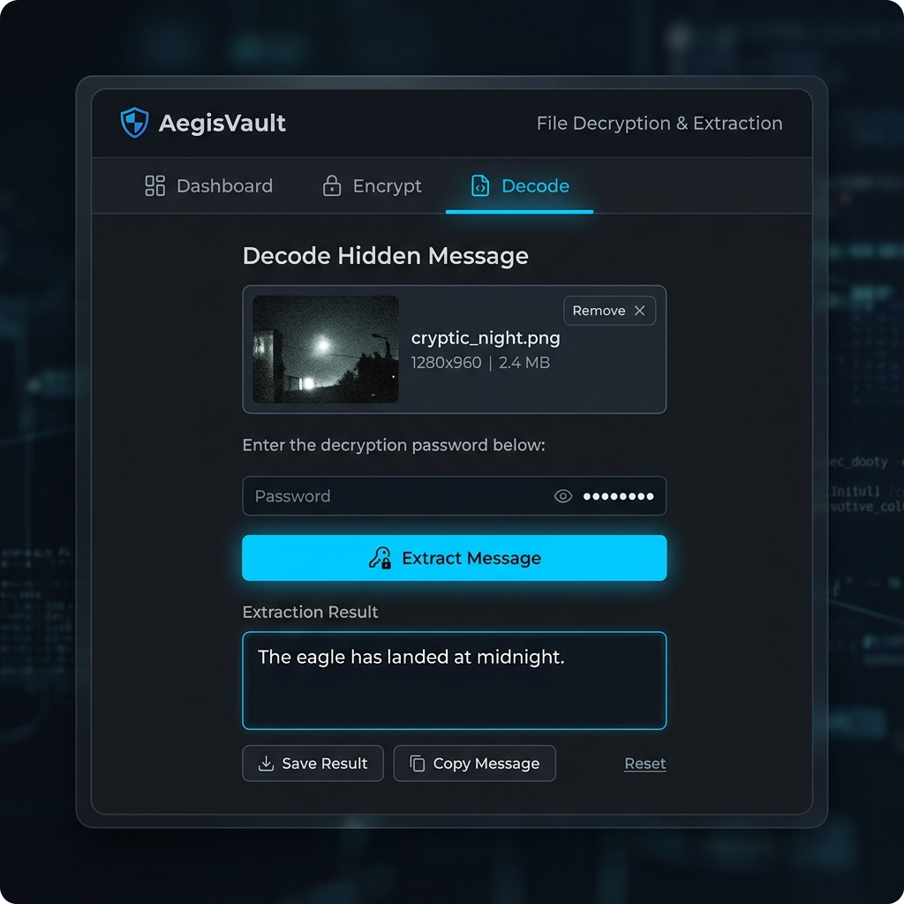
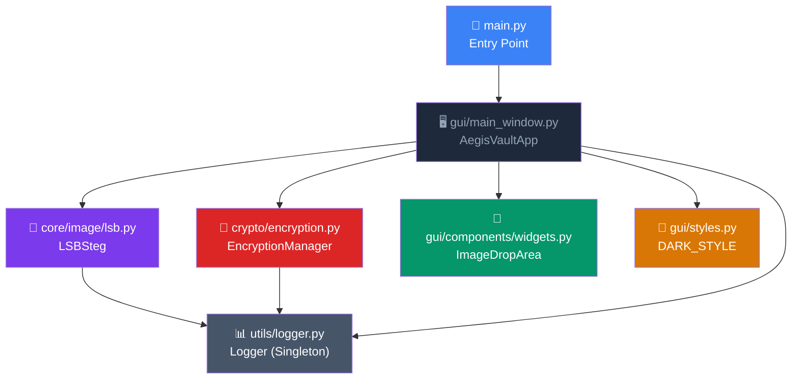
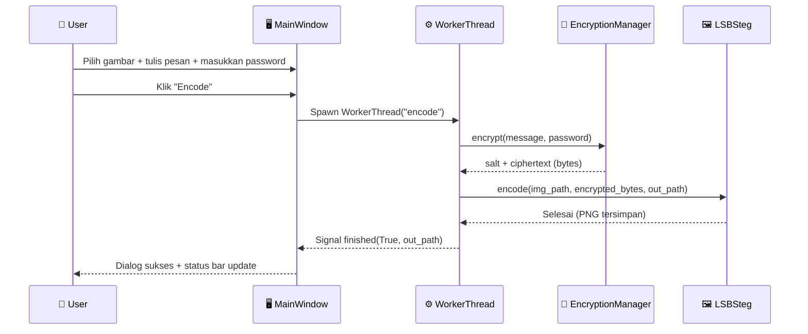

<div align="center">


# 🛡️ AegisVault
### *Secure Image Steganography with Military-Grade Encryption*

---

[](https://www.python.org/)
[](https://doc.qt.io/qtforpython/)
[](./LICENSE)
[]()
[]()
[-red?style=for-the-badge&logo=letsencrypt&logoColor=white)]()
[]()

<br/>

> **"Sembunyikan rahasiamu di balik piksel — tanpa meninggalkan jejak."**
>
> AegisVault adalah aplikasi steganografi gambar bertenaga enkripsi AES-256 dengan antarmuka grafis modern berbasis Qt6.
> Pesan rahasia Anda **dienkripsi terlebih dahulu**, lalu **disembunyikan di dalam gambar PNG** menggunakan algoritma LSB (Least Significant Bit).
> Tidak ada metadata mencurigakan. Tidak ada perubahan visual. Hanya piksel yang menyimpan rahasia.

<br/>

[🚀 Mulai Cepat](#-instalasi-cepat) • [📖 Dokumentasi](#-cara-kerja-teknis) • [🖼️ Screenshot](#️-screenshot--tampilan-aplikasi) • [🧩 Arsitektur](#-arsitektur-proyek) • [🤝 Kontribusi](#-berkontribusi)

</div>

---

## 📋 Daftar Isi

- [✨ Tentang AegisVault](#-tentang-aegisvault)
- [🎯 Fitur Unggulan](#-fitur-unggulan)
- [🖼️ Screenshot & Tampilan Aplikasi](#️-screenshot--tampilan-aplikasi)
- [⚙️ Cara Kerja Teknis](#️-cara-kerja-teknis)
  - [🔐 Pipeline Enkripsi](#-pipeline-enkripsi)
  - [🖼️ Algoritma LSB Steganografi](#️-algoritma-lsb-steganografi)
  - [🔑 Manajemen Kunci (PBKDF2 + Fernet)](#-manajemen-kunci-pbkdf2--fernet)
- [🧩 Arsitektur Proyek](#-arsitektur-proyek)
  - [Struktur Direktori](#struktur-direktori)
  - [Diagram Modul](#diagram-modul)
- [💻 Kompatibilitas Sistem](#-kompatibilitas-sistem)
- [📦 Instalasi Cepat](#-instalasi-cepat)
  - [Prasyarat](#prasyarat)
  - [Langkah Instalasi](#langkah-instalasi)
- [🚀 Cara Penggunaan](#-cara-penggunaan)
  - [Mode Encode: Sembunyikan Pesan](#mode-encode-sembunyikan-pesan)
  - [Mode Decode: Ekstrak Pesan](#mode-decode-ekstrak-pesan)
  - [Antarmuka Drag & Drop](#antarmuka-drag--drop)
- [🛡️ Keamanan & Kriptografi](#️-keamanan--kriptografi)
  - [Lapisan Pertama: Enkripsi Fernet (AES-256-CBC)](#lapisan-pertama-enkripsi-fernet-aes-256-cbc)
  - [Lapisan Kedua: LSB Steganografi dengan Kompresi zlib](#lapisan-kedua-lsb-steganografi-dengan-kompresi-zlib)
  - [Payload Format](#payload-format)
  - [Analisis Ancaman](#analisis-ancaman)
- [📐 Kapasitas Penyimpanan](#-kapasitas-penyimpanan)
- [🔧 API Referensi](#-api-referensi)
  - [LSBSteg](#lsbsteg)
  - [EncryptionManager](#encryptionmanager)
  - [Logger](#logger)
  - [ImageDropArea](#imagedroparea)
- [🪵 Sistem Logging](#-sistem-logging)
- [🗂️ Format File & Kompatibilitas](#️-format-file--kompatibilitas)
- [❓ FAQ - Pertanyaan yang Sering Diajukan](#-faq---pertanyaan-yang-sering-diajukan)
- [🐛 Troubleshooting](#-troubleshooting)
- [🗺️ Roadmap](#️-roadmap)
- [🤝 Berkontribusi](#-berkontribusi)
- [📜 Lisensi](#-lisensi)
- [🙏 Penghargaan & Kredit](#-penghargaan--kredit)

---

## ✨ Tentang AegisVault

**AegisVault** adalah aplikasi **steganografi gambar open-source** yang memungkinkan pengguna untuk menyembunyikan pesan teks rahasia di dalam file gambar PNG, dengan lapisan keamanan ganda:

1. **Enkripsi AES-256** menggunakan Fernet dari library `cryptography` — standar enkripsi tingkat militer
2. **Steganografi LSB** — pesan disembunyikan di bit paling tidak signifikan dari setiap piksel, sehingga perubahan tidak terlihat secara visual

Nama *"AegisVault"* terinspirasi dari **Aegis** (perisai Zeus dalam mitologi Yunani) yang melambangkan perlindungan terkuat, dan **Vault** (brankas) yang melambangkan keamanan penyimpanan data.

### Mengapa AegisVault?

| Fitur | AegisVault | Steganografi Biasa |
|---|---|---|
| Enkripsi data | ✅ AES-256 | ❌ Tidak ada |
| GUI Modern | ✅ Qt6 Dark Mode | ❌ CLI saja |
| Drag & Drop | ✅ Ya | ❌ Tidak |
| Kompresi payload | ✅ zlib | ❌ Tidak |
| Magic signature | ✅ Validasi `AEGIS` | ❌ Tidak ada |
| Logging | ✅ File + Console | ❌ Tidak ada |
| Cross-platform | ✅ Win/Mac/Linux | ⚠️ Terbatas |

---

## 🎯 Fitur Unggulan

### 🔒 Keamanan Berlapis
- **Enkripsi AES-256 (Fernet)** sebelum data disematkan ke gambar
- **PBKDF2-HMAC-SHA256** dengan **100.000 iterasi** untuk key derivation — sangat tahan terhadap brute-force
- **Salt acak 16 byte** per enkripsi — tidak ada dua enkripsi yang menghasilkan ciphertext yang sama, bahkan dengan password yang sama
- **Magic signature `AEGIS`** untuk validasi integritas gambar

### 🖼️ LSB Steganografi Berkinerja Tinggi
- Menggunakan **NumPy vectorized operations** untuk embedding bit — sangat cepat bahkan pada gambar resolusi tinggi
- Kompresi **zlib** sebelum embedding untuk memaksimalkan kapasitas
- Mendukung gambar **RGBA** (4 channel: R, G, B, Alpha)
- Kapasitas: **≈ `lebar × tinggi × 0.5` byte** per gambar

### 🖥️ Antarmuka GUI Profesional (Qt6 / PySide6)
- **Dark Mode** yang elegan dengan palet warna Slate modern
- **Tab interface** dengan dua mode: Encode dan Decode
- **Drag & Drop** — cukup seret gambar ke jendela aplikasi
- **Preview gambar** real-time setelah pemilihan file
- **Progress bar** untuk memantau proses encoding/decoding
- **Password visibility toggle** — tombol mata untuk menampilkan/menyembunyikan password
- **Copy to Clipboard** — salin hasil decode langsung ke clipboard
- **Worker Thread** — proses berjalan di background thread agar UI tidak freeze

### 📊 Logging Komprehensif
- Log tersimpan otomatis di folder `logs/` dengan nama file berdasarkan tanggal
- Singleton pattern untuk Logger — satu instance di seluruh aplikasi
- Format log lengkap: timestamp, level, modul, fungsi, nomor baris

---

## 🖼️ Screenshot & Tampilan Aplikasi

<div align="center">

### 🔐 Mode Encode — Sembunyikan Pesan


<br/>

### 🔓 Mode Decode — Ekstrak Pesan


</div>

---

## ⚙️ Cara Kerja Teknis

### 🔐 Pipeline Enkripsi

Proses **Encode** (menyembunyikan pesan) berjalan melalui pipeline berikut:

```
[ Pesan Teks Asli ]
        │
        ▼
[ Enkripsi Fernet (AES-256-CBC) ]
   ├── Generate salt acak (16 byte, os.urandom)
   ├── Turunkan kunci via PBKDF2-HMAC-SHA256 (100.000 iterasi)
   └── Hasilkan: [ salt (16B) + ciphertext ]
        │
        ▼
[ Kompresi zlib ]
   └── Kompres payload terenkripsi
        │
        ▼
[ Bangun Payload LSB ]
   ├── Magic Signature: b"AEGIS" (5 byte)
   ├── Panjang Data: 4 byte (big-endian uint32)
   └── Data Terkompresi
        │
        ▼
[ Embedding LSB ke Piksel RGBA ]
   └── Setiap bit payload → bit LSB dari setiap sub-piksel
        │
        ▼
[ Simpan sebagai PNG (lossless) ]
```

Proses **Decode** (mengekstrak pesan) adalah kebalikannya:

```
[ Gambar PNG ]
        │
        ▼
[ Baca bit LSB dari piksel ]
        │
        ▼
[ Validasi Magic Signature "AEGIS" ]
        │
        ▼
[ Baca 4 byte panjang → ekstrak data ]
        │
        ▼
[ Dekompresi zlib ]
        │
        ▼
[ Dekripsi Fernet dengan password ]
   ├── Ambil salt dari 16 byte pertama
   ├── Derive kunci via PBKDF2
   └── Dekripsi ciphertext → plaintext
        │
        ▼
[ Pesan Teks Asli ]
```

---

### 🖼️ Algoritma LSB Steganografi

**LSB (Least Significant Bit)** adalah teknik steganografi paling umum yang bekerja dengan mengganti bit paling kecil dari nilai warna piksel. Perubahan 0 atau 1 pada bit terakhir secara visual **tidak dapat dibedakan** oleh mata manusia.

**Contoh Visual:**

```
Nilai piksel asli:  [200, 150, 100, 255]  →  warna tampak sama
                    [201, 150, 100, 255]  →  (hanya beda 1/255 ≈ 0.4%)
```

**Implementasi dengan NumPy (vectorized):**

```python
# Embed bits menggunakan operasi bitwise vectorized
flat_pixels[:len(bits)] = (flat_pixels[:len(bits)] & np.uint8(254)) | bits
#                           ↑ hapus LSB                               ↑ set LSB baru
```

Operasi `& 0b11111110` (mask 254) menghapus bit terakhir, kemudian `| bit` menyetel bit baru. Ini jauh lebih cepat dibanding loop Python biasa karena NumPy mengeksekusi operasi ini dalam satu vektor pada level C.

---

### 🔑 Manajemen Kunci (PBKDF2 + Fernet)

```python
# 1. Generate salt acak (unik per enkripsi)
salt = os.urandom(16)   # 128-bit salt

# 2. Derive kunci dari password menggunakan PBKDF2-HMAC-SHA256
kdf = PBKDF2HMAC(
    algorithm=hashes.SHA256(),  # Hash function
    length=32,                  # Output 256-bit key
    salt=salt,
    iterations=100_000,         # Iterasi tinggi = brute-force mahal
)
key = base64.urlsafe_b64encode(kdf.derive(password.encode()))

# 3. Enkripsi menggunakan Fernet (AES-256-CBC + HMAC-SHA256)
f = Fernet(key)
ciphertext = f.encrypt(message.encode())

# 4. Simpan: salt (16B) + ciphertext
payload = salt + ciphertext
```

**Mengapa PBKDF2?**
- Dirancang khusus untuk *password-based key derivation*
- 100.000 iterasi membutuhkan waktu komputasi signifikan — ini **disengaja** untuk memperlambat brute-force
- Setiap salt yang unik memastikan bahwa dua pesan dengan password yang sama akan menghasilkan kunci yang berbeda (*rainbow table attack* tidak efektif)

---

## 🧩 Arsitektur Proyek

### Struktur Direktori

```
AegisVault/
│
├── 📄 main.py                      # Entry point aplikasi
├── 📄 requirements.txt             # Dependensi Python
├── 📄 README.md                    # Dokumentasi ini
├── 📄 LICENSE                      # Lisensi MIT
├── 📄 CONTRIBUTING.md              # Panduan kontribusi
├── 📄 .gitignore                   # File yang diabaikan Git
│
├── 📁 assets/                      # Aset statis
│   ├── 🖼️  banner.png             # Banner header aplikasi
│   ├── 🖼️  encode.png             # Screenshot mode encode
│   └── 🖼️  decode.png             # Screenshot mode decode
│
├── 📁 logs/                        # Log aplikasi (auto-generated)
│   └── 📄 app_YYYYMMDD.log        # Log harian
│
└── 📁 src/                         # Source code utama
    │
    ├── 📁 core/                    # Logika inti steganografi
    │   └── 📁 image/
    │       └── 📄 lsb.py          # Algoritma LSB encode/decode
    │
    ├── 📁 crypto/                  # Modul kriptografi
    │   └── 📄 encryption.py       # PBKDF2 + Fernet AES-256
    │
    ├── 📁 gui/                     # Antarmuka pengguna grafis
    │   ├── 📄 main_window.py      # Jendela utama & logika UI
    │   ├── 📄 styles.py           # Qt stylesheet (Dark/Light mode)
    │   └── 📁 components/
    │       └── 📄 widgets.py      # Widget kustom (ImageDropArea)
    │
    └── 📁 utils/                   # Utilitas umum
        └── 📄 logger.py           # Singleton logger
```

### Diagram Modul



### Alur Data Lengkap



---

## 💻 Kompatibilitas Sistem

| Sistem Operasi | Status | Catatan |
|---|---|---|
| ✅ Windows 10/11 | **Fully Supported** | Direkomendasikan |
| ✅ macOS 12+ (Monterey) | **Supported** | Butuh PySide6 via pip |
| ✅ Ubuntu 20.04+ | **Supported** | Butuh `libxcb` dependencies |
| ✅ Debian/Fedora | **Supported** | Uji sendiri |
| ⚠️ Python 3.10 | **Mungkin Bekerja** | Belum diuji resmi |
| ❌ Python < 3.10 | **Tidak Didukung** | Gunakan `match-case` syntax |

**Versi Python yang Direkomendasikan:** `Python 3.11` atau `3.12`

---

## 📦 Instalasi Cepat

### Prasyarat

Sebelum memulai, pastikan Anda sudah menginstal:

- **Python 3.11+** → [Download Python](https://www.python.org/downloads/)
- **pip** (biasanya sudah termasuk dengan Python)
- **Git** (opsional, untuk clone) → [Download Git](https://git-scm.com/)

Verifikasi instalasi Python:
```bash
python --version
# Output: Python 3.11.x atau lebih baru

pip --version
# Output: pip 23.x.x ...
```

### Langkah Instalasi

#### 1️⃣ Clone Repositori

```bash
git clone https://github.com/Athallah1234/Steganografi.git
cd Steganografi
```

Atau jika Anda mengunduh ZIP, ekstrak dan masuk ke foldernya.

#### 2️⃣ Buat Virtual Environment (Sangat Direkomendasikan)

```bash
# Windows
python -m venv venv
venv\Scripts\activate

# macOS / Linux
python3 -m venv venv
source venv/bin/activate
```

Anda akan melihat `(venv)` di awal baris terminal Anda — ini menandakan virtual environment aktif.

#### 3️⃣ Instal Dependensi

```bash
pip install -r requirements.txt
```

Perintah ini akan menginstal:

| Library | Versi Min | Fungsi |
|---|---|---|
| `PySide6` | `>=6.5.0` | Framework GUI Qt6 |
| `Pillow` | `>=10.0.0` | Manipulasi gambar (buka, simpan PNG) |
| `cryptography` | `>=41.0.0` | Enkripsi Fernet (AES-256) + PBKDF2 |
| `pyperclip` | `>=1.8.2` | Copy ke clipboard lintas platform |
| `zstandard` | `>=0.21.0` | Kompresi data (dependency) |
| `numpy` | *(auto)* | Operasi array piksel yang cepat |

> **Catatan:** `numpy` akan otomatis diinstal sebagai dependency dari `Pillow` atau dapat diinstal secara eksplisit.

#### 4️⃣ Jalankan Aplikasi

```bash
python main.py
```

Jendela **AegisVault** akan terbuka! 🎉

#### ⚡ Instalasi Satu Baris (Copy-Paste)

```bash
git clone https://github.com/Athallah1234/Steganografi.git && cd Steganografi && python -m venv venv && venv\Scripts\activate && pip install -r requirements.txt && python main.py
```

---

## 🚀 Cara Penggunaan

### Mode Encode: Sembunyikan Pesan

**Langkah demi langkah:**

1. **Buka aplikasi** dengan menjalankan `python main.py`
2. **Pilih tab "🔐 Encode (Sembunyikan)"** (tab aktif secara default)
3. **Pilih gambar dasar** — klik area drop atau seret file PNG ke sana
   - Hanya format **PNG** yang didukung (format lossless)
   - Gambar boleh berwarna atau grayscale
4. **Masukkan pesan rahasia** di kotak teks yang tersedia
   - Mendukung teks panjang, karakter Unicode, emoji, dll.
5. **Masukkan password enkripsi** yang kuat
   - Password ini WAJIB diingat — tidak ada cara recovery jika lupa
   - Klik ikon 👁 untuk menampilkan/menyembunyikan password
6. **Klik "Mulai Encode & Simpan"**
7. **Pilih lokasi simpan** untuk file PNG hasil steganografi
8. ✅ Selesai! Pesan Anda kini tersembunyi dalam gambar

```
💡 Tips:
- Gunakan gambar beresolusi besar untuk menyembunyikan pesan yang lebih panjang
- Gambar hasil steganografi tampak IDENTIK dengan aslinya secara visual
- Simpan password di tempat yang aman (password manager direkomendasikan)
```

---

### Mode Decode: Ekstrak Pesan

**Langkah demi langkah:**

1. **Pilih tab "🔓 Decode (Ekstrak)"**
2. **Pilih gambar steganografi** — gambar PNG yang mengandung pesan tersembunyi
3. **Masukkan password enkripsi** yang sama saat encoding
4. **Klik "Ekstrak Pesan"**
5. **Pesan akan muncul** di panel "Hasil Decode"
6. Klik **"Salin ke Clipboard"** untuk menyalin pesan

```
⚠️ Peringatan:
- Jika password salah, dekripsi akan gagal dengan error "Incorrect password or corrupted data"
- Jika gambar bukan gambar AegisVault, akan muncul error "This image does not contain a valid AegisVault message"
```

---

### Antarmuka Drag & Drop

AegisVault mendukung **drag & drop** penuh:

```
┌─────────────────────────────────────┐
│                                     │
│   📂 Tarik & Lepas Gambar ke Sini  │
│        atau Klik untuk Memilih     │
│                                     │
└─────────────────────────────────────┘
        ↑ Seret file PNG dari File Explorer
```

- **Seret** file `.png` dari File Explorer/Finder langsung ke area ini
- **Klik** area ini untuk membuka dialog pemilihan file
- Preview gambar akan langsung ditampilkan setelah pemilihan

---

## 🛡️ Keamanan & Kriptografi

### Lapisan Pertama: Enkripsi Fernet (AES-256-CBC)

**Fernet** adalah implementasi enkripsi simetris yang aman dari library `cryptography`. Ia menggunakan:

- **AES-128-CBC** (dengan kunci 256-bit dari PBKDF2) untuk enkripsi data
- **HMAC-SHA256** untuk autentikasi pesan (integritas data)
- **IV (Initialization Vector)** acak pada setiap enkripsi

Format Fernet token:
```
Version (1B) | Timestamp (8B) | IV (16B) | Ciphertext (NB) | HMAC (32B)
```

### Lapisan Kedua: LSB Steganografi dengan Kompresi zlib

Setelah enkripsi, data dikompresi dengan **zlib** sebelum disematkan. Ini memiliki dua manfaat:
1. **Efisiensi**: Data yang lebih kecil = lebih sedikit piksel yang dimodifikasi
2. **Obfuscation tambahan**: Pola statistik data terenkripsi semakin tersamarkan setelah kompresi

### Payload Format

Format payload yang disematkan dalam piksel gambar:

```
┌──────────────────────────────────────────────────────────────────┐
│  5 byte  │    4 byte    │           N byte                       │
│ "AEGIS"  │ payload_len  │  zlib.compress(salt + Fernet_token)   │
│ (magic)  │ (big-endian) │  (terenkripsi + terkompresi)           │
└──────────────────────────────────────────────────────────────────┘
```

Distribusi bit dalam gambar RGBA:

```
Piksel [R] [G] [B] [A] [R] [G] [B] [A] ...
Bit    [0] [1] [2] [3] [4] [5] [6] [7] ← bit payload ke-0 s/d ke-7
```

### Analisis Ancaman

| Ancaman | Mitigasi |
|---|---|
| **Brute-force password** | PBKDF2 dengan 100.000 iterasi membuat setiap percobaan sangat lambat |
| **Dictionary attack** | Salt unik per enkripsi membuat precomputed tables tidak berguna |
| **Visual steganalysis** | Perubahan LSB tidak terlihat mata manusia (delta max = 1/255 ≈ 0.4%) |
| **Statistical steganalysis** | Kompresi zlib mengacak pola statistik data |
| **Tampering/corruption** | HMAC dari Fernet mendeteksi modifikasi data |
| **Gambar bukan AegisVault** | Magic signature `AEGIS` memvalidasi sebelum dekripsi |
| **Ukuran payload melebihi kapasitas** | Validasi kapasitas sebelum encoding, exception dengan pesan jelas |

> ⚠️ **Disclaimer Keamanan**: AegisVault dirancang untuk edukasi dan penggunaan pribadi. Untuk kebutuhan keamanan kritis tingkat enterprise, konsultasikan dengan ahli keamanan informasi bersertifikat.

---

## 📐 Kapasitas Penyimpanan

Kapasitas maksimum pesan yang dapat disembunyikan bergantung pada ukuran gambar:

$$C_{bytes} = \frac{W \times H \times 4}{8} \text{ byte}$$

Di mana:
- $W$ = lebar gambar (piksel)
- $H$ = tinggi gambar (piksel)
- $4$ = jumlah channel (RGBA)
- $8$ = jumlah bit per byte

**Tabel Referensi Kapasitas:**

| Resolusi Gambar | Ukuran File | Kapasitas Bruto | Kapasitas Efektif* |
|---|---|---|---|
| 320 × 240 (QVGA) | ~37 KB | **38,400 byte** | ~25 KB |
| 640 × 480 (VGA) | ~147 KB | **153,600 byte** | ~100 KB |
| 1280 × 720 (HD) | ~576 KB | **460,800 byte** | ~300 KB |
| 1920 × 1080 (Full HD) | ~1.3 MB | **1,036,800 byte** | ~675 KB |
| 3840 × 2160 (4K UHD) | ~5.2 MB | **4,147,200 byte** | ~2.7 MB |

> *Kapasitas efektif sudah memperhitungkan overhead: magic signature (5B), header panjang (4B), enkripsi Fernet (+overhead), dan kompresi zlib.

---

## 🔧 API Referensi

### `LSBSteg`

Kelas inti untuk operasi steganografi. Terletak di `src/core/image/lsb.py`.

#### `LSBSteg.encode(image_path, data, output_path, progress_callback=None)`

Menyematkan data biner ke dalam gambar menggunakan teknik LSB.

| Parameter | Tipe | Deskripsi |
|---|---|---|
| `image_path` | `str` | Path ke gambar PNG sumber |
| `data` | `bytes` | Data biner yang akan disembunyikan |
| `output_path` | `str` | Path untuk menyimpan gambar hasil |
| `progress_callback` | `callable` | Opsional. Fungsi yang menerima `int` (0-100) |

**Raises:**
- `ValueError`: Jika ukuran payload melebihi kapasitas gambar
- `IOError`: Jika file gambar tidak dapat dibuka

**Contoh:**
```python
from src.core.image.lsb import LSBSteg

LSBSteg.encode(
    image_path="foto.png",
    data=b"data rahasia",
    output_path="hasil.png",
    progress_callback=lambda p: print(f"Progress: {p}%")
)
```

---

#### `LSBSteg.decode(image_path, progress_callback=None) -> bytes`

Mengekstrak data biner dari gambar steganografi.

| Parameter | Tipe | Deskripsi |
|---|---|---|
| `image_path` | `str` | Path ke gambar PNG yang mengandung data tersembunyi |
| `progress_callback` | `callable` | Opsional. Fungsi progress |

**Returns:** `bytes` — data biner yang telah diekstrak dan didekompresi

**Raises:**
- `ValueError`: Jika magic signature tidak ditemukan atau data korup
- `zlib.error`: Jika dekompresi gagal

**Contoh:**
```python
from src.core.image.lsb import LSBSteg

data = LSBSteg.decode("hasil.png")
print(data)  # Output: bytes dari data tersembunyi
```

---

### `EncryptionManager`

Kelas untuk manajemen kriptografi. Terletak di `src/crypto/encryption.py`.

#### `EncryptionManager.encrypt(message, password) -> bytes`

Mengenkripsi pesan teks menggunakan password.

| Parameter | Tipe | Deskripsi |
|---|---|---|
| `message` | `str` | Pesan plaintext yang akan dienkripsi |
| `password` | `str` | Password untuk derivasi kunci |

**Returns:** `bytes` — `salt (16B) + Fernet_token`

**Contoh:**
```python
from src.crypto.encryption import EncryptionManager

encrypted = EncryptionManager.encrypt("pesan rahasia", "password_kuat_123")
print(type(encrypted))  # <class 'bytes'>
print(len(encrypted))   # 16 (salt) + overhead Fernet
```

---

#### `EncryptionManager.decrypt(data, password) -> str`

Mendekripsi data terenkripsi menggunakan password.

| Parameter | Tipe | Deskripsi |
|---|---|---|
| `data` | `bytes` | Data terenkripsi (`salt + Fernet_token`) |
| `password` | `str` | Password yang digunakan saat enkripsi |

**Returns:** `str` — pesan plaintext asli

**Raises:**
- `ValueError`: Jika password salah atau data korup

**Contoh:**
```python
from src.crypto.encryption import EncryptionManager

# Enkripsi
data = EncryptionManager.encrypt("pesan rahasia", "password_123")

# Dekripsi
pesan = EncryptionManager.decrypt(data, "password_123")
print(pesan)  # "pesan rahasia"
```

---

#### `EncryptionManager.generate_key(password, salt=None) -> tuple[bytes, bytes]`

Menghasilkan kunci kriptografi dari password menggunakan PBKDF2.

| Parameter | Tipe | Deskripsi |
|---|---|---|
| `password` | `str` | Password sumber |
| `salt` | `bytes` | Opsional. Jika `None`, salt baru akan di-generate |

**Returns:** `tuple[bytes, bytes]` — `(fernet_key, salt)`

---

### `Logger`

Singleton logger untuk seluruh aplikasi. Terletak di `src/utils/logger.py`.

```python
from src.utils.logger import logger

logger.debug("Pesan debug")
logger.info("Informasi penting")
logger.warning("Peringatan")
logger.error("Terjadi kesalahan")
logger.critical("Kesalahan fatal")
```

Format log output:
```
2026-07-31 10:00:00 | INFO     | lsb:encode:43 - Successfully encoded 256 bytes into hasil.png
```

---

### `ImageDropArea`

Widget kustom PySide6 untuk area drop gambar. Terletak di `src/gui/components/widgets.py`.

**Signal:**
- `fileDropped(str)` — dipancarkan saat file di-drop, membawa path file

**Metode:**
- `set_image(path: str)` — menampilkan preview gambar dalam widget

```python
from src.gui.components.widgets import ImageDropArea

drop_area = ImageDropArea()
drop_area.fileDropped.connect(lambda path: print(f"File: {path}"))
```

---

## 🪵 Sistem Logging

AegisVault menggunakan sistem logging dua lapis:

### Log ke File
- Lokasi: `logs/app_YYYYMMDD.log` (e.g., `logs/app_20260731.log`)
- Level minimum: `INFO`
- File baru dibuat setiap hari

### Log ke Console
- Level minimum: `DEBUG`
- Ditampilkan langsung di terminal saat aplikasi berjalan

### Contoh Output Log
```log
2026-07-31 10:09:12 | INFO     | main:main:8 - Initializing AegisVault...
2026-07-31 10:09:13 | INFO     | main:main:18 - AegisVault GUI Started Successfully.
2026-07-31 10:09:45 | INFO     | lsb:encode:43 - Successfully encoded 1024 bytes into stego_result.png
2026-07-31 10:10:02 | INFO     | lsb:decode:80 - Successfully decoded 1024 bytes from stego_result.png
```

---

## 🗂️ Format File & Kompatibilitas

### Format Input yang Didukung

| Format | Ekstensi | Status | Catatan |
|---|---|---|---|
| PNG | `.png` | ✅ **Didukung Penuh** | Format lossless, direkomendasikan |
| JPEG | `.jpg`, `.jpeg` | ❌ Tidak Didukung | Kompresi lossy merusak LSB |
| BMP | `.bmp` | ❌ Tidak Didukung | Belum diimplementasikan |
| TIFF | `.tiff` | ❌ Tidak Didukung | Belum diimplementasikan |
| WebP | `.webp` | ❌ Tidak Didukung | Belum diimplementasikan |

> 📌 **Mengapa hanya PNG?**
> Format JPEG menggunakan kompresi *lossy* yang **mengubah nilai piksel** saat menyimpan. Hal ini akan menghancurkan bit-bit LSB yang telah kita sembunyikan, membuat pesan tidak dapat dipulihkan. PNG menggunakan kompresi *lossless* sehingga nilai piksel terjaga sempurna.

### Format Output

Semua hasil encoding disimpan sebagai **PNG lossless** — menjamin integritas bit LSB yang tersembunyi.

---

## ❓ FAQ - Pertanyaan yang Sering Diajukan

**Q: Apakah gambar yang sudah di-encode terlihat berbeda?**
> A: **Tidak.** Perubahan pada bit LSB mengakibatkan perbedaan nilai piksel maksimal 1 dari 255 (±0.4%). Perbedaan ini jauh di bawah ambang batas persepsi visual manusia. Gambar akan terlihat identik.

**Q: Bisakah saya menggunakan gambar JPEG?**
> A: **Tidak.** JPEG menggunakan kompresi lossy yang merusak data LSB. Selalu gunakan gambar PNG sebagai input dan output.

**Q: Apa yang terjadi jika saya lupa password?**
> A: **Pesan tidak dapat dipulihkan.** Enkripsi AES-256 dirancang agar tidak bisa dipecahkan tanpa kunci yang benar. Selalu simpan password Anda di tempat yang aman.

**Q: Apakah ukuran file gambar akan bertambah setelah encoding?**
> A: **Hampir tidak.** Karena hanya bit terakhir dari setiap piksel yang diubah, konten gambar hampir identik. Ukuran file PNG mungkin sedikit berubah karena perbedaan kompresi zlib internal PNG, namun biasanya perubahan tidak signifikan.

**Q: Bisakah saya menyembunyikan file (bukan hanya teks)?**
> A: **Saat ini tidak.** AegisVault v1.x hanya mendukung pesan teks. Dukungan untuk file biner (gambar, dokumen) direncanakan untuk versi berikutnya.

**Q: Apakah AegisVault aman untuk menyimpan informasi sensitif?**
> A: AegisVault menggunakan kriptografi standar industri (AES-256 + PBKDF2). Namun untuk penggunaan keamanan kritis, selalu lakukan audit keamanan independen.

**Q: Bisakah saya menggunakan gambar yang sama untuk menyembunyikan beberapa pesan?**
> A: **Tidak direkomendasikan.** Setiap encode akan menimpa (overwrite) pesan sebelumnya di piksel yang sama. Gunakan gambar berbeda untuk setiap pesan.

**Q: Mengapa aplikasi berjalan di background thread?**
> A: Untuk mencegah UI *freeze* saat memproses gambar besar. `WorkerThread` menjalankan operasi komputasi berat (enkripsi + LSB) di thread terpisah, sementara thread utama tetap responsif untuk interaksi user.

---

## 🐛 Troubleshooting

### ❌ `ModuleNotFoundError: No module named 'PySide6'`
**Solusi:**
```bash
pip install PySide6>=6.5.0
```

### ❌ `ModuleNotFoundError: No module named 'PIL'`
**Solusi:**
```bash
pip install Pillow>=10.0.0
```

### ❌ `xcb` error di Linux
**Solusi (Ubuntu/Debian):**
```bash
sudo apt-get install libxcb-cursor0 libxcb-icccm4 libxcb-image0 libxcb-keysyms1 libxcb-render-util0
```

### ❌ `ValueError: Message too large!`
**Penyebab:** Pesan terlalu panjang untuk kapasitas gambar yang dipilih.
**Solusi:** Gunakan gambar yang lebih besar atau perpendek pesan Anda. Lihat [Tabel Kapasitas](#-kapasitas-penyimpanan).

### ❌ `ValueError: This image does not contain a valid AegisVault message`
**Penyebab:** Gambar tidak mengandung pesan AegisVault, atau gambar telah dikompresi ulang/dikonversi formatnya.
**Solusi:** Pastikan Anda menggunakan gambar PNG asli hasil dari proses encode AegisVault.

### ❌ `ValueError: Incorrect password or corrupted data`
**Penyebab:** Password yang dimasukkan salah.
**Solusi:** Periksa kembali password Anda. Perhatikan huruf besar/kecil dan karakter spesial.

### ❌ Aplikasi tidak mau terbuka di Windows
**Solusi:**
```bash
# Pastikan virtual environment aktif
venv\Scripts\activate
python main.py
```

### ❌ `pyperclip.PyperclipException` di Linux
**Solusi:**
```bash
# Install xclip atau xsel
sudo apt-get install xclip
# atau
sudo apt-get install xsel
```

---

## 🗺️ Roadmap

Berikut adalah fitur-fitur yang direncanakan untuk versi mendatang:

### v1.1 — Peningkatan UI/UX
- [ ] 🌞 **Light Mode** yang fungsional penuh
- [ ] 🔄 **Drag & Drop** yang lebih responsif dengan animasi
- [ ] 📊 **Meter kapasitas** gambar secara real-time
- [ ] 🔍 **Preview side-by-side** gambar asli vs hasil encode

### v1.2 — Ekspansi Format
- [ ] 🖼️ Dukungan format **BMP** sebagai input/output
- [ ] 🖼️ Dukungan format **TIFF** sebagai input/output
- [ ] 📁 **Sembunyikan file** (bukan hanya teks) di dalam gambar

### v1.3 — Keamanan Lanjutan
- [ ] 🔐 Pilihan algoritma enkripsi: **AES-GCM**, **ChaCha20-Poly1305**
- [ ] 🔢 Dukungan **multiple LSB bits** (1-4 bit per channel) untuk trade-off kapasitas/keamanan
- [ ] 🎲 **LSB Randomization** menggunakan PRNG berbasis seed untuk distribusi bit yang lebih acak

### v2.0 — Fitur Enterprise
- [ ] 🌐 **REST API** untuk integrasi dengan sistem lain
- [ ] 📱 **Mobile port** (Android/iOS)
- [ ] 📦 **Batch processing** — encode/decode banyak gambar sekaligus
- [ ] 🔑 **Asymmetric encryption** (RSA/ECC) untuk berbagi kunci yang aman
- [ ] 🖥️ **CLI mode** untuk otomasi via script

---

## 🤝 Berkontribusi

Kami sangat senang menerima kontribusi dari komunitas! 🎉

### Cara Berkontribusi

1. **Fork** repositori ini
2. **Clone** fork Anda:
   ```bash
   git clone https://github.com/USERNAME_ANDA/Steganografi.git
   ```
3. **Buat branch baru** untuk fitur/perbaikan Anda:
   ```bash
   git checkout -b fitur/FiturHebat
   # atau
   git checkout -b fix/PerbaikanBug
   ```
4. **Lakukan perubahan** dan commit:
   ```bash
   git add .
   git commit -m "✨ Menambahkan fitur: [deskripsi singkat]"
   ```
5. **Push** ke branch Anda:
   ```bash
   git push origin fitur/FiturHebat
   ```
6. **Buat Pull Request** ke branch `main` repositori ini

### Standar Kode

- Ikuti **PEP 8** untuk gaya penulisan kode Python
- Tambahkan **docstring** untuk setiap fungsi/kelas publik
- Sertakan **komentar** pada logika yang kompleks
- Pastikan kode Anda **tidak merusak** fungsionalitas yang sudah ada

### Melaporkan Bug

Temukan bug? [Buka Issue baru](https://github.com/Athallah1234/Steganografi/issues/new) dengan menyertakan:
- Sistem operasi dan versi Python
- Langkah-langkah untuk mereproduksi bug
- Pesan error yang muncul (jika ada)
- Screenshot jika relevan

### Mengajukan Fitur

Punya ide fitur baru? [Buka Feature Request](https://github.com/Athallah1234/Steganografi/issues/new) dan jelaskan:
- Deskripsi fitur yang diinginkan
- Alasan mengapa fitur ini berguna
- Sketsa implementasi (jika ada)

---

## 📜 Lisensi

Proyek ini dilisensikan di bawah **MIT License** — lihat file [LICENSE](./LICENSE) untuk detail lengkap.

```
MIT License

Copyright (c) 2026 Antigravity

Permission is hereby granted, free of charge, to any person obtaining a copy
of this software and associated documentation files (the "Software"), to deal
in the Software without restriction...
```

---

## 🙏 Penghargaan & Kredit

Proyek ini dibangun di atas bahu para raksasa:

| Library | Deskripsi | Link |
|---|---|---|
| **PySide6** | Python bindings untuk Qt6 framework | [doc.qt.io](https://doc.qt.io/qtforpython/) |
| **Pillow (PIL)** | Library manipulasi gambar Python | [python-pillow.org](https://python-pillow.org/) |
| **cryptography** | Library kriptografi tingkat tinggi dan rendah | [cryptography.io](https://cryptography.io/) |
| **NumPy** | Komputasi numerik berkinerja tinggi | [numpy.org](https://numpy.org/) |
| **pyperclip** | Akses clipboard lintas platform | [GitHub](https://github.com/asweigart/pyperclip) |

---

<div align="center">

### ⭐ Jika AegisVault bermanfaat, beri bintang di GitHub!

[](https://github.com/Athallah1234/Steganografi/stargazers)
[](https://github.com/Athallah1234/Steganografi/network/members)
[](https://github.com/Athallah1234/Steganografi/watchers)

<br/>

**Dibuat dengan ❤️ oleh [Antigravity](https://github.com/Athallah1234)**

*"Keamanan terbaik adalah yang tidak terlihat."*

<br/>

[](https://forthebadge.com)
[](https://forthebadge.com)

</div>
