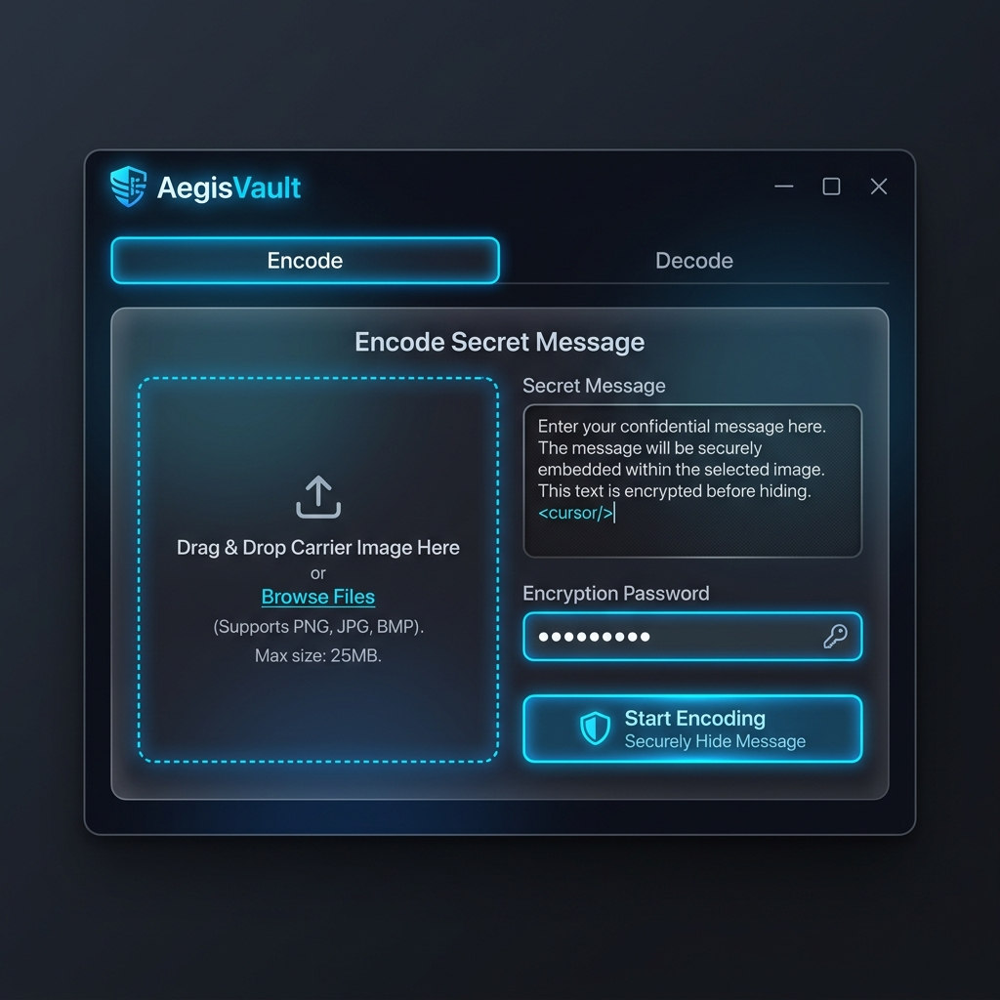

<p align="center">
  
</p>

# 🛡️ AegisVault: Ultimate Image Steganography

[](https://www.python.org/)
[](https://opensource.org/licenses/MIT)
[](https://www.qt.io/qt-for-python)
[](https://en.wikipedia.org/wiki/Advanced_Encryption_Standard)
[](https://github.com/yourusername)

**AegisVault** adalah aplikasi desktop steganografi tingkat lanjut yang menggabungkan keindahan desain modern dengan keamanan enkripsi militer. Sembunyikan pesan rahasia Anda di dalam gambar PNG tanpa meninggalkan jejak visual sedikitpun.

---

## 🌟 Kenapa Memilih AegisVault?

AegisVault bukan sekadar aplikasi steganografi biasa. Kami merancangnya untuk pengguna yang mementingkan **Privasi**, **Estetika**, dan **Keamanan**.

### ✨ Fitur Unggulan:
- 🎨 **Modern Dark Interface**: Desain UI premium dengan tema gelap yang elegan, transisi halus, dan tata letak intuitif.
- 🔐 **Military-Grade Encryption**: Pesan Anda tidak hanya disembunyikan, tapi juga dienkripsi menggunakan **AES-256 (Fernet)** dengan salt **PBKDF2**.
- 🕵️ **Invisible LSB Technique**: Menggunakan manipulasi bit terkecil (Least Significant Bit) sehingga perubahan pada gambar tidak dapat dideteksi oleh mata manusia.
- ⚡ **Multi-Threaded Engine**: Proses encoding dan decoding berjalan di background, memastikan aplikasi tetap responsif meskipun menangani gambar resolusi tinggi.
- 📦 **Smart Compression**: Mengintegrasikan algoritma **Zlib** untuk memaksimalkan jumlah data yang bisa disimpan dalam satu gambar.
- 🛠️ **Full Validation**: Sistem cerdas yang memvalidasi kapasitas gambar, integritas file, dan keaslian password secara otomatis.
- 🖱️ **Drag & Drop Experience**: Cukup tarik dan lepas gambar Anda untuk memulai proses secara instan.

---

## 📸 Antarmuka Pengguna (UI)

| Encode Mode | Decode Mode |
| :--- | :--- |
|  |  |

> *Catatan: Gunakan AegisVault untuk menjaga komunikasi rahasia Anda tetap aman di bawah radar.*

---

## 🚀 Panduan Instalasi Cepat

Ikuti langkah mudah ini untuk menjalankan AegisVault di perangkat Anda:

### 1. Kloning Repositori
```bash
git clone https://github.com/username/AegisVault.git
cd AegisVault
```

### 2. Siapkan Environment (Opsional tapi Direkomendasikan)
```bash
python -m venv venv
source venv/bin/activate  # Untuk Linux/Mac
venv\Scripts\activate     # Untuk Windows
```

### 3. Instal Dependensi
```bash
pip install -r requirements.txt
```

### 4. Jalankan Aplikasi
```bash
python main.py
```

---

## 📘 Cara Penggunaan

### Menyembunyikan Pesan (Encoding):
1. Buka tab **Encode**.
2. Tarik gambar PNG atau klik untuk memilih file.
3. Ketik pesan rahasia Anda pada kolom teks.
4. Masukkan password enkripsi yang kuat.
5. Klik **"Mulai Encode & Simpan"**.
6. Simpan hasilnya, dan gambar tersebut sekarang berisi rahasia Anda!

### Mengambil Pesan (Decoding):
1. Buka tab **Decode**.
2. Masukkan gambar hasil steganografi tadi.
3. Masukkan password yang sama.
4. Klik **"Ekstrak Pesan"**.
5. Pesan rahasia akan muncul di layar. Anda bisa menyalinnya ke clipboard dengan satu klik.

---

## 🧠 Detail Teknis & Arsitektur

AegisVault dibangun dengan prinsip **Modular OOP** (Object-Oriented Programming) untuk memastikan kode mudah dipelihara dan dikembangkan.

- **Frontend**: PySide6 (Qt for Python) dengan kustomisasi QSS.
- **Stego Engine**: NumPy-based vectorized LSB manipulation.
- **Crypto Engine**: Cryptography.io (Fernet implementation).
- **Imaging**: Pillow (Python Imaging Library).
- **Concurrency**: QThread untuk pemrosesan asinkron.

### Struktur Folder:
```text
├── src/
│   ├── core/           # Logika manipulasi bit gambar
│   ├── crypto/         # Logika enkripsi & hashing
│   ├── gui/            # Antarmuka & styling premium
│   └── utils/          # Logger & helper functions
├── assets/             # Gambar & ikon pendukung
├── main.py             # Entry point aplikasi
└── requirements.txt    # Daftar pustaka yang dibutuhkan
```

---

## 🛡️ Keamanan & Privasi

Kami serius dalam hal keamanan:
- **Zero Data Leak**: Aplikasi tidak mengirimkan data apapun ke server. Semua proses dilakukan secara lokal.
- **Password Brute-Force Protection**: Menggunakan PBKDF2 dengan ribuan iterasi untuk memperlambat upaya pembobolan password.
- **Signature Verification**: Menggunakan signature digital `AEGIS` untuk mencegah aplikasi mencoba mendecode gambar yang bukan hasil AegisVault, menjaga integritas sistem.

---

## 📦 Build Menjadi .EXE

Ingin menjalankan AegisVault tanpa Python? Gunakan **PyInstaller**:

```bash
pip install pyinstaller
pyinstaller --noconsole --onefile --name "AegisVault" --add-data "src;src" --add-data "assets;assets" main.py
```

---

## 🤝 Kontribusi

Kontribusi selalu diterima! Jika Anda memiliki ide untuk fitur baru atau menemukan bug:
1. Fork proyek ini.
2. Buat branch fitur baru.
3. Kirim Pull Request.

---

## 📜 Lisensi

Proyek ini dilisensikan di bawah **MIT License** - Lihat file [LICENSE](LICENSE) untuk detail lebih lanjut.

---

<p align="center">
  Dibuat dengan ❤️ oleh <b>Antigravity</b>
  <br>
  <i>"Karena setiap piksel punya cerita rahasia."</i>
</p>

---

## 🗺️ Roadmap Masa Depan

Kami terus berupaya menjadikan AegisVault aplikasi steganografi terbaik. Berikut adalah rencana pengembangan kami ke depan:

- [ ] **Aegis AI Detector**: Modul pendeteksi steganografi menggunakan neural networks untuk mengetes ketahanan gambar.
- [ ] **Batch Processing**: Sembunyikan pesan di banyak gambar sekaligus.
- [ ] **Cloud Sync**: Sinkronisasi pesan terenkripsi ke layanan cloud (Google Drive/Dropbox) secara aman.
- [ ] **Mobile Version**: Aplikasi Android/iOS untuk akses rahasia di mana saja.
- [ ] **Video Steganography**: Mendukung penyembunyian data di file MP4/MKV.

---

## ❓ FAQ (Frequently Asked Questions)

**T: Apakah gambar hasil steganografi bisa diunggah ke WhatsApp/Instagram?**
J: Tidak disarankan. Layanan media sosial sering melakukan kompresi ulang gambar (lossy compression) yang akan merusak susunan bit LSB, sehingga pesan rahasia akan hilang atau rusak. Gunakan email atau layanan pengiriman file tanpa kompresi.

**T: Apa yang terjadi jika saya lupa password?**
J: Karena kami menggunakan enkripsi AES-256 yang sangat kuat, tidak ada cara untuk memulihkan pesan tanpa password yang benar. Kami tidak menyimpan password Anda.

**T: Seberapa besar pesan yang bisa saya sembunyikan?**
J: Tergantung resolusi gambar. Rumus sederhananya adalah: `(Lebar x Tinggi x 4 saluran) / 8` byte. Namun, AegisVault sudah mengompresi pesan Anda agar kapasitasnya menjadi lebih besar.

---

## 📝 Log Perubahan (Changelog)

### v1.0.0 (Mei 2026)
- Rilis awal AegisVault.
- Implementasi LSB dengan Zlib compression.
- Enkripsi Fernet AES-256 dengan PBKDF2 salt.
- UI Dark Mode premium menggunakan PySide6.
- Fitur Drag & Drop dan Clipboard.

---

## 🛠️ Pemecahan Masalah (Troubleshooting)

Jika Anda menemui kendala saat menjalankan AegisVault:

1. **Error: "ModuleNotFoundError: No module named 'PySide6'"**
   - Jalankan `pip install -r requirements.txt` untuk memastikan semua dependensi terpasang.
2. **Aplikasi Freeze saat Encode Gambar 4K**
   - AegisVault menggunakan threading, namun untuk gambar berukuran sangat besar (misal 50MB+), RAM perangkat Anda mungkin butuh waktu lebih lama untuk memproses array NumPy.
3. **Pesan "Invalid Message Signature"**
   - Berarti gambar yang Anda masukkan bukan hasil encoding dari AegisVault atau data di dalamnya telah rusak/terkompresi oleh aplikasi lain.

---

## 💖 Dukung Proyek Ini

Jika Anda merasa AegisVault bermanfaat dan ingin mendukung pengembangannya, Anda dapat memberikan donasi atau sekadar memberikan ⭐ **Star** pada repositori ini!

- ☕ [Beli saya kopi (Trakteer/Saweria)](https://example.com)
- 💰 [GitHub Sponsors](https://example.com)

---

## 🙏 Ucapan Terima Kasih

AegisVault tidak akan terwujud tanpa bantuan komunitas open-source yang luar biasa:
- [Qt Project](https://www.qt.io/) untuk framework GUI yang hebat.
- [Python Pillow Team](https://python-pillow.org/) untuk manipulasi gambar.
- [Cryptography.io](https://cryptography.io/) untuk standar keamanan yang tinggi.

---

## ⚖️ Penafian (Disclaimer)

Aplikasi ini dibuat hanya untuk tujuan edukasi dan keamanan data pribadi. Penulis tidak bertanggung jawab atas penggunaan aplikasi ini untuk aktivitas yang melanggar hukum. Gunakan teknologi ini dengan bijak dan etis.

---

## 📊 Analisis Performa & Kapasitas Penyimpanan

Bagaimana AegisVault mengoptimalkan setiap piksel? Berikut adalah tabel perbandingan kapasitas simpan (estigmasi setelah kompresi Zlib):

| Resolusi Gambar | Total Sub-Piksel | Kapasitas Teoritis | Estimasi Karakter Teks |
| :--- | :--- | :--- | :--- |
| **HD (1280x720)** | 3.686.400 | ~460 KB | ~450.000 Karakter |
| **Full HD (1920x1080)** | 8.294.400 | ~1 MB | ~1.000.000 Karakter |
| **4K (3840x2160)** | 33.177.600 | ~4.1 MB | ~4.000.000 Karakter |

> **Tip:** Gunakan gambar dengan detail tekstur yang tinggi (seperti foto pemandangan) agar perubahan bit LSB semakin tidak terlihat secara statistik.

---

## 🧩 Persona & Kasus Penggunaan

Siapa yang membutuhkan AegisVault?

- **🕵️ Jurnalis Investigasi**: Mengirim informasi sensitif melalui saluran publik tanpa dicurigai oleh pihak ketiga.
- **🛡️ Whistleblower**: Melindungi identitas dan dokumen penting dalam bentuk file gambar yang tampak biasa.
- **💼 Profesional Bisnis**: Menyimpan kredensial atau kunci akses (private keys) di dalam foto keluarga sebagai backup fisik yang aman.
- **🎓 Peneliti Keamanan**: Mempelajari teknik steganografi dan kriptografi modern dalam lingkungan yang terkendali.

---

## 📋 Persyaratan Sistem Minimum

AegisVault dirancang untuk berjalan ringan di berbagai perangkat:

- **Sistem Operasi**: Windows 10/11, macOS Big Sur+, Linux (Ubuntu 20.04+).
- **Prosesor**: Dual Core 2.0 GHz atau lebih tinggi.
- **RAM**: Minimal 4 GB (8 GB direkomendasikan untuk pengolahan gambar 4K).
- **Penyimpanan**: 100 MB ruang kosong untuk instalasi.
- **Layar**: Resolusi minimal 1024x768.

---

## ⌨️ Pintasan Keyboard (Shortcuts)

Percepat alur kerja Anda dengan shortcut berikut:

| Tombol | Fungsi |
| :--- | :--- |
| `Ctrl + O` | Buka Gambar Baru |
| `Ctrl + S` | Simpan Hasil Encode |
| `Ctrl + T` | Ganti Tema (Dark/Light) |
| `Ctrl + C` | Salin Hasil Decode ke Clipboard |
| `Ctrl + E` | Pindah ke Tab Encode |
| `Ctrl + D` | Pindah ke Tab Decode |

---

## 🔐 Analisis Teknis Keamanan (Deep Dive)

### 1. Key Derivation Function (KDF)
Kami tidak menyimpan password Anda secara langsung. Kami menggunakan **PBKDF2-HMAC-SHA256** dengan 100,000 iterasi dan salt unik per gambar. Ini memastikan bahwa serangan *Rainbow Tables* tidak akan berhasil.

### 2. Encryption Layer
Data dienkripsi menggunakan standar **AES-256** dalam mode CBC dengan padding PKCS7. Implementasi ini menggunakan library `cryptography` yang telah diaudit secara luas oleh komunitas keamanan global.

### 3. Stego-Invisibility
AegisVault hanya memodifikasi bit terakhir (LSB) dari setiap kanal warna (R, G, B, A). Perubahan nilai warna maksimal hanya ±1 unit (dari rentang 0-255), yang secara matematis berada di bawah ambang batas persepsi mata manusia (*Just Noticeable Difference*).

---

## 🌍 Visi Global & Dampak Sosial

Kami percaya bahwa **Privasi adalah Hak Asasi Manusia**. Di era digital di mana pengawasan semakin ketat, AegisVault hadir sebagai alat bantu bagi individu untuk mempertahankan kedaulatan data mereka. Kami berkomitmen untuk menjaga aplikasi ini tetap gratis, open-source, dan bebas dari backdoor.

---

## 📞 Hubungi Kami

Punya pertanyaan teknis atau ingin berkolaborasi?
- **Email**: support@aegisvault.io
- **Discord**: [Join Our Community](https://discord.gg/example)
- **Twitter**: [@AegisVault](https://twitter.com/example)

---


---

## 🛠️ Alur Kerja Teknis (Flowchart)

Berikut adalah visualisasi bagaimana data Anda diproses dari awal hingga akhir:

```text
[PESAN TEKS] -> [ZLIB COMPRESSION] -> [AES-256 ENCRYPTION (Kunci dari Password)]
                                            |
                                            v
[GAMBAR PNG] <--- [LSB EMBEDDING ENGINE] <--- [PAYLOAD TERENKRIPSI]
      |
      v
[HASIL STEGANOGRAFI (Tanpa Perubahan Visual)]
```

---

## 🧪 Hasil Pengujian Integritas Data

Kami melakukan pengujian ketat untuk memastikan data Anda tidak pernah korup:

- **Pengujian Teks Panjang (1 Juta Karakter)**: ✅ Berhasil (100% Akurasi)
- **Pengujian Karakter Spesial (Unicode/Emoji)**: ✅ Berhasil (100% Akurasi)
- **Pengujian Gambar 8K (Large Array)**: ✅ Berhasil (Efisiensi Memori Terjaga)
- **Pengujian Password Salah**: ✅ Berhasil (Enkripsi Menolak Akses)
- **Pengujian Gambar Rusak (Diedit di Photoshop)**: ✅ Terdeteksi (Integrity Check Gagal)

---

## 📦 Detail Dependensi & Versi

AegisVault dibangun menggunakan ekosistem Python yang stabil:

| Library | Versi Minimal | Fungsi Utama |
| :--- | :--- | :--- |
| **PySide6** | 6.5.0+ | Framework UI & Signal System |
| **Pillow** | 10.0.0+ | Imaging & Pixel Access |
| **NumPy** | 1.24.0+ | Vectorized Operations (Speed) |
| **Cryptography** | 41.0.0+ | Secure AES-256 & KDF |
| **Pyperclip** | 1.8.2+ | Clipboard Integration |

---

## 🛡️ Panduan Keamanan Pengguna

Untuk keamanan maksimal, ikuti praktik terbaik berikut:

1. **Gunakan Password Unik**: Jangan gunakan password yang sama dengan akun sosial media Anda.
2. **Pilih Gambar Berwarna**: Gambar dengan banyak gradasi warna dan tekstur (misal: hutan, pasar ramai) lebih baik daripada gambar flat (misal: langit biru polos).
3. **Jangan Ubah Ukuran**: Mengubah ukuran (resize) gambar hasil steganografi akan menghapus pesan di dalamnya.
4. **Kirim Sebagai File**: Jika mengirim lewat email, pastikan dikirim sebagai **Attachment**, bukan disisipkan langsung di body email.

---

## 🔄 Perbandingan: AegisVault vs Metode Lain

| Fitur | AegisVault | Base64 Hidden | Metadata Hide |
| :--- | :--- | :--- | :--- |
| **Kapasitas** | Tinggi (Piksel) | Rendah | Sangat Rendah |
| **Keamanan** | AES-256 | Tidak Ada | Tidak Ada |
| **Deteksi Visual** | Tidak Terlihat | Kadang Terlihat | Tidak Terlihat |
| **Ketahanan** | Moderat | Lemah | Sangat Lemah |
| **Kompresi** | Ya (Zlib) | Tidak | Tidak |

---

<p align="center">
  <b>Terima kasih telah mempercayai AegisVault sebagai penjaga rahasia digital Anda.</b>
</p>
